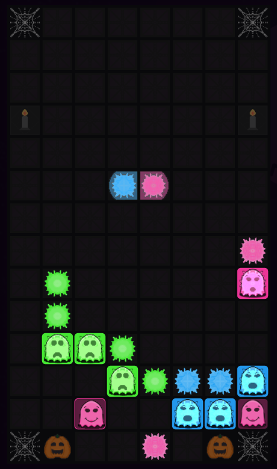
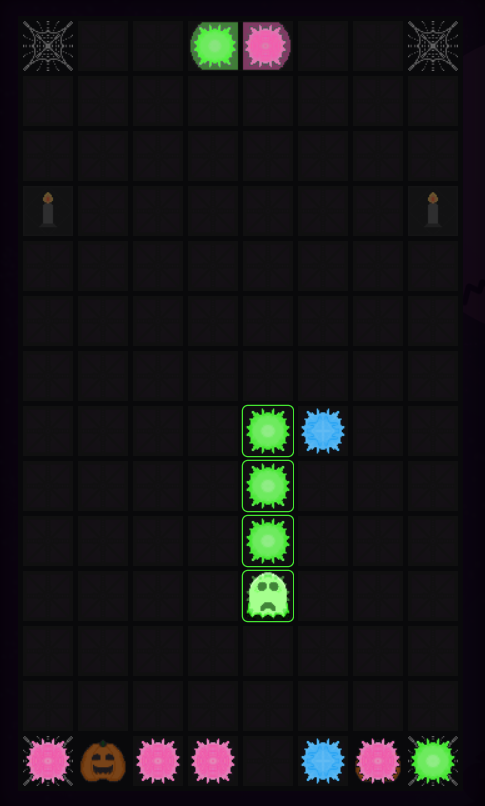

# Haunted House

PvE game where you explore a haunted mansion full of ghosts. Use plasma bullets to get rid of the creatures. #SvelteHack2024

[Live demo](https://hauntedhousegame.netlify.app/) | [Source](https://github.com/martaProsniak/haunted-house)

## Features

- Enemies - colorful ghosts, which attempt to escape!
- Weapon - plasma bullets, which you can control with keyboard
- Equipment - special bullets, which speed up your work
- HP
- Levels
- [Game guide](https://hauntedhousegame.netlify.app/guide)

## Technologies

- [SvelteKit](https://svelte.dev/)
- [Tailwind.css](https://tailwindcss.com/)

## Screenshots

    
    

## Run locally

- `git clone https://github.com/martaProsniak/haunted-house.git && cd haunted-house`
- `npm install && npm run dev`